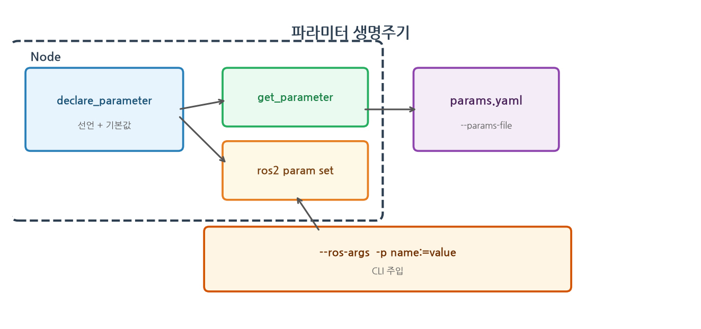
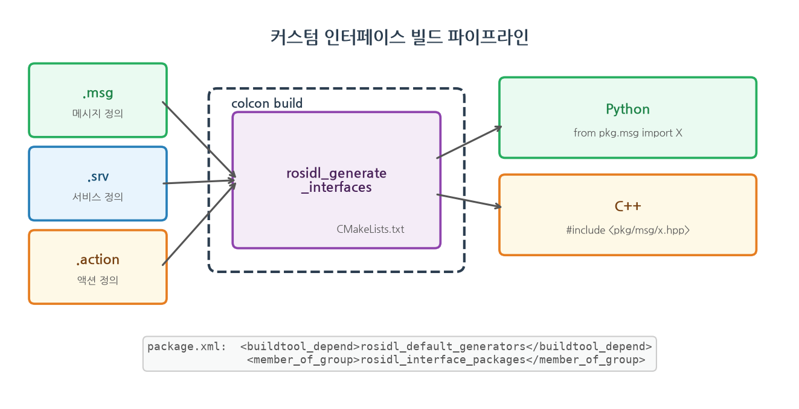
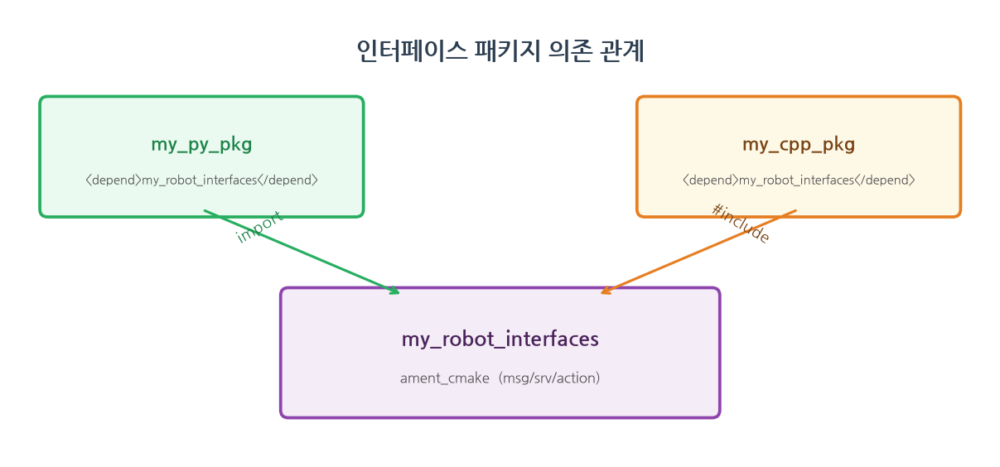

# 6장. 파라미터와 커스텀 인터페이스

> **학습 목표**
> - 파라미터(parameter)로 노드를 재컴파일 없이 설정하는 법을 익힌다.
> - CLI와 YAML 두 가지 방법으로 파라미터를 주입하고 런타임에 변경한다.
> - Python과 C++ 양쪽에서 파라미터를 선언하고 사용한다.
> - 나만의 메시지/서비스/액션 타입(.msg/.srv/.action)을 만들고 빌드한다.

> **이번 장의 산출물**
> - 파라미터로 동작을 바꾸는 노드(Python, C++)와 YAML 설정을 작성한다.
> - 커스텀 인터페이스 패키지를 빌드하고 다른 패키지에서 사용한다.
>
> **공통 학습 흐름**: 개념 → 따라하기 → 코드 해설 → 실행 확인 → 버전/환경 체크 → 트러블슈팅 → 연습문제 → 마무리 점검

3~5장에서 토픽, 서비스, 액션으로 노드 간 통신을 배웠다. 하지만 발행 주기를 바꾸려면
코드를 고치고 다시 빌드해야 했다. 이 장에서는 코드를 건드리지 않고 노드 동작을
바꾸는 방법(파라미터)과, 도메인에 맞는 나만의 타입을 정의하는 방법(커스텀 인터페이스)을
배운다.

---

## 6.1 파라미터란 — 코드를 안 고치고 바꾸기

파라미터는 노드의 **설정값**이다. 발행 주기, 로봇 이름, 속도 한계처럼 바뀔 수 있는 값을
코드에 박지 않고 밖에서 주입한다. 같은 노드를 다른 설정으로 재사용할 수 있다.

파라미터의 흐름을 그림으로 보자.



파라미터를 쓰는 흐름은 세 단계다.

1. 노드 코드에서 **선언**(declare_parameter) — 이름과 기본값을 정한다
2. 실행 시 **주입** — CLI(-p name:=value) 또는 YAML 파일로 기본값을 덮어쓴다
3. 실행 중 **조회/변경** — ros2 param get/set 으로 런타임에 읽고 바꾼다

> Jazzy에서 선언하지 않은 파라미터를 set 하면 ParameterNotDeclaredException 이 발생한다.
> 반드시 declare_parameter 로 먼저 선언해야 한다.

---

## 6.2 [따라하기] 파라미터 사용 — Python

2장에서 만든 my_py_pkg 에 파라미터를 쓰는 노드를 추가한다.

**① 노드 파일 작성**

~/ros2_ws/src/my_py_pkg/my_py_pkg/configurable_publisher.py 를 만든다.

```python
import rclpy
from rclpy.node import Node
from std_msgs.msg import Int64


class ConfigurablePublisher(Node):
    def __init__(self):
        super().__init__("configurable_publisher")

        self.declare_parameter("publish_period", 1.0)
        self.declare_parameter("robot_name", "turtle")

        period = self.get_parameter("publish_period").value
        name = self.get_parameter("robot_name").value
        self.get_logger().info(f"{name} / 주기 {period}s")

        self.pub_ = self.create_publisher(Int64, "number", 10)
        self.create_timer(period, self.tick)
        self.counter_ = 0

    def tick(self):
        msg = Int64()
        msg.data = self.counter_
        self.pub_.publish(msg)
        self.counter_ += 1


def main(args=None):
    rclpy.init(args=args)
    node = ConfigurablePublisher()
    rclpy.spin(node)
    rclpy.shutdown()
```

**② setup.py 에 노드 등록**

setup.py 의 console_scripts 에 추가한다.

```python
entry_points={
    'console_scripts': [
        'configurable_publisher = my_py_pkg.configurable_publisher:main',
    ],
},
```

**③ 빌드 및 실행**

```bash
cd ~/ros2_ws
colcon build --packages-select my_py_pkg
source ~/ros2_ws/install/setup.bash
```

기본값으로 실행하면 1초 간격으로 발행한다.

```bash
ros2 run my_py_pkg configurable_publisher
```

CLI로 파라미터를 주입하면 기본값을 덮어쓴다.

```bash
ros2 run my_py_pkg configurable_publisher --ros-args -p publish_period:=0.5 -p robot_name:=bot
```

**④ 런타임 조회와 변경**

노드가 실행 중인 상태에서 다른 터미널을 열고 아래를 실행한다.
새 터미널에서는 source ~/ros2_ws/install/setup.bash 를 잊지 않는다.

```bash
ros2 param list
ros2 param get /configurable_publisher publish_period
ros2 param set /configurable_publisher robot_name bot2
```

> ros2 param set 으로 값을 바꿔도, 위 코드처럼 __init__ 에서 한 번만 읽는 구조면
> 실제 동작은 바뀌지 않는다. 런타임 변경을 반영하려면 콜백에서 매번 get_parameter 를
> 호출하거나 add_on_set_parameters_callback 을 사용해야 한다. 이 부분은 6.7절
> 워크드 예제에서 다룬다.

---

## 6.3 [따라하기] 파라미터 사용 — C++

같은 기능을 C++ 로 만들어 본다. Python과 API 구조가 거의 같다.

~/ros2_ws/src/my_cpp_pkg/src/configurable_publisher.cpp 를 만든다.

```cpp
#include "rclcpp/rclcpp.hpp"
#include "std_msgs/msg/int64.hpp"

class ConfigurablePublisher : public rclcpp::Node
{
public:
    ConfigurablePublisher() : Node("configurable_publisher"), counter_(0)
    {
        this->declare_parameter("publish_period", 1.0);
        this->declare_parameter("robot_name", std::string("turtle"));

        double period = this->get_parameter("publish_period").as_double();
        std::string name = this->get_parameter("robot_name").as_string();
        RCLCPP_INFO(this->get_logger(), "%s / 주기 %.1fs", name.c_str(), period);

        pub_ = this->create_publisher<std_msgs::msg::Int64>("number", 10);
        timer_ = this->create_wall_timer(
            std::chrono::milliseconds(static_cast<int>(period * 1000)),
            std::bind(&ConfigurablePublisher::tick, this));
    }

private:
    void tick()
    {
        auto msg = std_msgs::msg::Int64();
        msg.data = counter_++;
        pub_->publish(msg);
    }

    rclcpp::Publisher<std_msgs::msg::Int64>::SharedPtr pub_;
    rclcpp::TimerBase::SharedPtr timer_;
    int64_t counter_;
};

int main(int argc, char **argv)
{
    rclcpp::init(argc, argv);
    rclcpp::spin(std::make_shared<ConfigurablePublisher>());
    rclcpp::shutdown();
    return 0;
}
```

CMakeLists.txt 에 빌드 대상과 의존성을 추가한다.

```cmake
find_package(std_msgs REQUIRED)

add_executable(configurable_publisher src/configurable_publisher.cpp)
ament_target_dependencies(configurable_publisher rclcpp std_msgs)

install(TARGETS configurable_publisher
  DESTINATION lib/${PROJECT_NAME})
```

package.xml 에 의존성을 추가한다.

```xml
<depend>std_msgs</depend>
```

빌드하고 실행한다.

```bash
cd ~/ros2_ws
colcon build --packages-select my_cpp_pkg
source ~/ros2_ws/install/setup.bash
ros2 run my_cpp_pkg configurable_publisher --ros-args -p publish_period:=0.3
```

> **Python vs C++ 파라미터 API 비교**
>
> | 작업 | Python | C++ |
> |---|---|---|
> | 선언 | self.declare_parameter("name", default) | this->declare_parameter("name", default) |
> | 읽기 | self.get_parameter("name").value | this->get_parameter("name").as_double() |
> | 타입 | .value 가 자동 추론 | .as_double(), .as_string() 등 명시 |

---

## 6.4 YAML로 파라미터 일괄 주입

파라미터가 많아지면 CLI가 길어진다. YAML 파일에 한꺼번에 적고 불러오는 것이 실무에서
일반적이다.

**① YAML 파일 작성**

~/ros2_ws/src/my_py_pkg/config/params.yaml 을 만든다.

```yaml
configurable_publisher:
  ros__parameters:
    publish_period: 0.2
    robot_name: "fast_bot"
```

> YAML 최상위 키는 노드 이름과 정확히 일치해야 한다. 이름이 다르면 파라미터가
> 적용되지 않는다. 가장 흔한 실수이므로 ros2 node list 로 노드 이름을 먼저 확인한다.

**② YAML로 실행**

```bash
ros2 run my_py_pkg configurable_publisher --ros-args --params-file ~/ros2_ws/src/my_py_pkg/config/params.yaml
```

7장 런치 파일에서 이 YAML을 노드에 자동으로 묶어 띄우는 법을 배운다.

> **Foxy → Jazzy 차이**
> 파라미터 API 자체는 Foxy 와 동일하다. 다만 Jazzy 에서는 declare_parameter 호출 시
> 타입 힌트(ParameterDescriptor)를 넣으면 잘못된 타입의 값이 들어올 때 자동으로
> 거부한다. Foxy 에서는 이 검증이 느슨했다. 또한 Jazzy 의 기본 동작은 선언되지 않은
> 파라미터의 set 을 거부(allow_undeclared_parameters=False)하므로, 반드시
> declare_parameter 를 먼저 호출해야 한다.

---

## 6.5 커스텀 인터페이스 — 나만의 타입

지금까지는 std_msgs, example_interfaces 같은 표준 타입을 썼다. 실제 프로젝트에서는
도메인에 맞는 타입이 필요하다. 예를 들어 로봇 하드웨어 상태, 회전 명령, 미로 목표
좌표 같은 것이다. 이를 위해 **인터페이스 전용 패키지**를 따로 만드는 것이 관례다.



.msg, .srv, .action 파일에 필드를 정의하면 rosidl 이 Python과 C++ 코드를 자동 생성한다.
이 과정이 CMake 기반이므로 인터페이스 패키지는 항상 ament_cmake 로 만든다.

### [따라하기] 인터페이스 패키지 생성

**① 패키지 뼈대 만들기**

```bash
cd ~/ros2_ws/src
ros2 pkg create my_robot_interfaces --build-type ament_cmake
```

> 인터페이스 패키지는 **항상 ament_cmake** 로 만든다. Python 프로젝트라 해도
> 마찬가지다. 메시지 코드 생성이 CMake 기반이기 때문이다.

**② 메시지/서비스/액션 폴더와 파일 생성**

```bash
cd my_robot_interfaces
mkdir msg srv action
```

**msg/HardwareStatus.msg** — 로봇 하드웨어 상태를 담는 메시지

```text
float64 temperature
bool are_motors_ready
string debug_message
```

**srv/TurnRobot.srv** — 회전 명령 서비스 (--- 위가 요청, 아래가 응답)

```text
float64 angle_deg
---
bool success
```

**action/Navigate.action** — 목표 좌표까지 이동하는 액션 (goal / result / feedback)

```text
float64 x
float64 y
---
bool reached
---
float64 distance_left
```

**③ CMakeLists.txt 설정**

CMakeLists.txt 에 아래를 추가한다.

```cmake
find_package(rosidl_default_generators REQUIRED)

rosidl_generate_interfaces(${PROJECT_NAME}
  "msg/HardwareStatus.msg"
  "srv/TurnRobot.srv"
  "action/Navigate.action"
)
```

> 액션 타입이 있으면 추가로 find_package(action_msgs REQUIRED) 가 필요할 수 있다.
> Jazzy 에서는 rosidl_default_generators 가 action_msgs 를 자동으로 끌어오므로
> 별도 추가 없이 빌드된다.

**④ package.xml 설정**

```xml
<buildtool_depend>rosidl_default_generators</buildtool_depend>
<exec_depend>rosidl_default_runtime</exec_depend>
<member_of_group>rosidl_interface_packages</member_of_group>
```

이 세 줄이 없으면 빌드가 실패한다. 각각의 역할은 다음과 같다.

| 태그 | 역할 |
|---|---|
| buildtool_depend | 빌드 시 코드 생성기가 필요함을 선언 |
| exec_depend | 실행 시 메시지 런타임 라이브러리가 필요함을 선언 |
| member_of_group | 이 패키지가 인터페이스 패키지임을 colcon 에 알린다 |

**⑤ 빌드 및 확인**

```bash
cd ~/ros2_ws
colcon build --packages-select my_robot_interfaces
source ~/ros2_ws/install/setup.bash
```

빌드가 성공하면 인터페이스를 조회할 수 있다.

```bash
ros2 interface show my_robot_interfaces/msg/HardwareStatus
ros2 interface show my_robot_interfaces/srv/TurnRobot
ros2 interface show my_robot_interfaces/action/Navigate
```

> 첫 빌드에서 rosidl 코드 생성이 포함되어 30초 이상 걸릴 수 있다. 이후에는
> 변경된 파일만 다시 생성하므로 빠르다.

---

## 6.6 커스텀 타입 사용하기

다른 패키지에서 커스텀 타입을 쓰려면 의존성을 선언한다.



### Python 에서 사용

사용할 패키지(my_py_pkg)의 package.xml 에 추가한다.

```xml
<depend>my_robot_interfaces</depend>
```

코드에서 import 한다.

```python
from my_robot_interfaces.msg import HardwareStatus
from my_robot_interfaces.srv import TurnRobot
```

### C++ 에서 사용

사용할 패키지(my_cpp_pkg)의 package.xml 에 동일하게 추가한다.

```xml
<depend>my_robot_interfaces</depend>
```

CMakeLists.txt 에 find_package 를 추가한다.

```cmake
find_package(my_robot_interfaces REQUIRED)
ament_target_dependencies(노드이름 rclcpp my_robot_interfaces)
```

코드에서 include 한다.

```cpp
#include "my_robot_interfaces/msg/hardware_status.hpp"
#include "my_robot_interfaces/srv/turn_robot.hpp"
```

> C++ 에서 메시지 헤더 경로는 CamelCase 가 아니라 snake_case 다.
> HardwareStatus → hardware_status.hpp, TurnRobot → turn_robot.hpp

> 빌드 순서는 colcon 이 package.xml 의 의존성을 읽어 자동 결정한다.
> my_robot_interfaces 가 먼저 빌드되고, 그것을 쓰는 패키지가 뒤에 빌드된다.
> 의존성 선언을 빠뜨리면 빌드 순서가 보장되지 않아 import/include 실패가 발생한다.

---

## 코드 해설 · 실행 확인 · 버전 체크

- **코드 해설 포인트**: declare_parameter 와 get_parameter 의 관계, YAML 키 구조(노드이름 > ros__parameters), rosidl_generate_interfaces 가 .msg 에서 Python/C++ 코드를 생성하는 과정을 해설한다.
- **실행 확인 포인트**: ros2 param list/get/set, ros2 interface show, ros2 interface list | grep my_robot 으로 결과를 확인한다.
- **버전/환경 체크**: Jazzy 에서 allow_undeclared_parameters 기본값이 False 인 점, rosidl 코드 생성 시 action_msgs 자동 포함 여부를 확인한다.

---

## 6.7 [워크드 예제] 런타임 파라미터 변경 반영

6.2절의 코드는 __init__ 에서 파라미터를 한 번만 읽었다. ros2 param set 으로 값을 바꿔도
실제 동작이 바뀌지 않았다. 콜백 안에서 매번 읽도록 바꿔 보자.

```python
import rclpy
from rclpy.node import Node
from std_msgs.msg import Int64


class DynamicPublisher(Node):
    def __init__(self):
        super().__init__("dynamic_publisher")
        self.declare_parameter("publish_period", 1.0)
        self.declare_parameter("max_count", 10)

        period = self.get_parameter("publish_period").value
        self.pub_ = self.create_publisher(Int64, "number", 10)
        self.timer_ = self.create_timer(period, self.tick)
        self.counter_ = 0

    def tick(self):
        max_count = self.get_parameter("max_count").value
        if self.counter_ >= max_count:
            self.get_logger().info("최대치 도달 — 발행 중지")
            return
        msg = Int64()
        msg.data = self.counter_
        self.pub_.publish(msg)
        self.get_logger().info(f"발행: {self.counter_}")
        self.counter_ += 1


def main(args=None):
    rclpy.init(args=args)
    node = DynamicPublisher()
    rclpy.spin(node)
    rclpy.shutdown()
```

```bash
ros2 run my_py_pkg dynamic_publisher --ros-args -p max_count:=3
```

0, 1, 2 를 발행한 뒤 멈춘다. 실행 중에 다른 터미널에서 값을 올려 보자.

```bash
ros2 param set /dynamic_publisher max_count 10
```

다시 발행이 재개된다. tick() 안에서 매번 get_parameter 를 호출하기 때문이다.

> 더 효율적인 방법은 add_on_set_parameters_callback 으로 변경 이벤트를 받는 것이다.
> 매 콜백마다 get 하는 대신, 파라미터가 바뀔 때만 내부 변수를 갱신한다.
> 16장 QoS 와 함께 심화에서 다룬다.

---

## 6.8 트러블슈팅 — 막혔을 때

| 증상 | 원인 | 해결 |
|---|---|---|
| ros2 interface show 에 안 보임 | 빌드/소싱 안 함 | colcon build 후 source ~/ros2_ws/install/setup.bash |
| No module named ...msg | 사용 패키지에 의존성 누락 | package.xml 에 \<depend\>my_robot_interfaces\</depend\> 추가 |
| 인터페이스 빌드 실패: rosidl 관련 | CMakeLists.txt 설정 누락 | find_package(rosidl_default_generators) + rosidl_generate_interfaces 확인 |
| 파라미터 미선언 오류 | declare_parameter 안 함 | 사용 전 반드시 선언. Jazzy 는 미선언 파라미터 set 을 거부함 |
| YAML 파라미터가 적용 안 됨 | 노드 이름 불일치 | YAML 최상위 키를 ros2 node list 결과와 일치시킨다 |
| C++ 헤더 못 찾음 | snake_case 아님 | HardwareStatus → hardware_status.hpp 로 변환 |
| 빌드 성공인데 interface list 에 없음 | member_of_group 누락 | package.xml 에 \<member_of_group\>rosidl_interface_packages\</member_of_group\> 추가 |
| 파라미터 set 했는데 동작 안 바뀜 | 값을 한 번만 읽음 | 콜백에서 매번 get_parameter 호출 (6.7절 참고) |

---

## 6.9 커스텀 인터페이스 — 흔한 실수 체크리스트

인터페이스 패키지는 설정이 까다로워 입문자가 가장 많이 막힌다. 빌드 실패 시 아래를 점검한다.

- [ ] 패키지를 --build-type ament_cmake 로 만들었나 (Python 패키지로 만들면 안 됨)
- [ ] CMakeLists.txt 에 find_package(rosidl_default_generators REQUIRED) 가 있나
- [ ] CMakeLists.txt 에 rosidl_generate_interfaces 로 .msg/.srv/.action 을 모두 나열했나
- [ ] package.xml 에 \<buildtool_depend\>rosidl_default_generators\</buildtool_depend\> 가 있나
- [ ] package.xml 에 \<exec_depend\>rosidl_default_runtime\</exec_depend\> 가 있나
- [ ] package.xml 에 \<member_of_group\>rosidl_interface_packages\</member_of_group\> 가 있나
- [ ] 사용하는 패키지의 package.xml 에 \<depend\>my_robot_interfaces\</depend\> 를 넣었나
- [ ] .msg 파일의 필드 타입이 올바른가 (float64, bool, string, int64 등 ROS 2 기본 타입)

---

## 6.10 연습문제

1. configurable_publisher 에 max_count 파라미터를 추가해 그 수까지만 발행하고 멈춰라.
2. HardwareStatus 메시지를 발행하는 노드를 만들어 ros2 topic echo 로 확인하라.
3. TurnRobot.srv 를 사용하는 서비스 서버를 작성하라 (각도를 받아 success 반환).
4. params.yaml 에 두 노드의 설정을 함께 적고 런치 없이 각각 불러와 보라.
5. (생각해보기) 인터페이스 패키지를 ament_python 으로 만들 수 없는 이유는 무엇인가

---

## 6.11 마무리 점검

- [ ] 파라미터로 노드를 외부에서 설정하고 런타임에 변경할 수 있다.
- [ ] Python과 C++ 양쪽에서 declare_parameter / get_parameter 를 쓸 수 있다.
- [ ] YAML로 파라미터를 일괄 주입할 수 있다.
- [ ] .msg/.srv/.action 을 정의하고 인터페이스 패키지를 빌드했다.
- [ ] 커스텀 타입을 다른 패키지에서 import/include 해 사용할 수 있다.
- [ ] C++ 에서 메시지 헤더 경로가 snake_case 임을 안다.

> **다음 장 예고** — 7장 **런치**. 지금까지 노드를 하나씩 손으로 켰지만, 실제 시스템은
> 노드 수십 개다. 런치 파일로 한 번에 띄우고 파라미터 YAML까지 묶는다.

---

## 6.12 연습문제 해설(요약)

- **1번** 6.7절 DynamicPublisher 가 정답. tick() 안에서 매번 max_count 를 읽어 비교한다.
- **2번** HardwareStatus 메시지를 채워 발행 후 ros2 topic echo /status 로 확인한다.
  필드는 temperature, are_motors_ready, debug_message 세 개다.
- **3번** TurnRobot.srv 로 서버 작성: 콜백에서 request.angle_deg 를 받아 처리하고
  response.success = True 반환한다. 4장 서비스 서버 구조 그대로다.
- **4번** YAML 최상위 키를 각 노드 이름과 일치시켜야 파라미터가 적용된다.
  노드 이름 불일치가 가장 흔한 실수다.
- **5번** rosidl 코드 생성기가 CMake 기반이기 때문이다. ament_python 에는 CMakeLists.txt 가
  없으므로 rosidl_generate_interfaces 를 호출할 수 없다.

---

### 참고 자료
- ROS 2 Jazzy — Using parameters in a class: https://docs.ros.org/en/jazzy/Tutorials/Beginner-Client-Libraries/Using-Parameters-In-A-Class-Python.html
- ROS 2 Jazzy — Creating custom msg and srv files: https://docs.ros.org/en/jazzy/Tutorials/Beginner-Client-Libraries/Custom-ROS2-Interfaces.html
- ROS 2 Jazzy — Parameter API reference: https://docs.ros.org/en/jazzy/Concepts/Basic/About-Parameters.html
